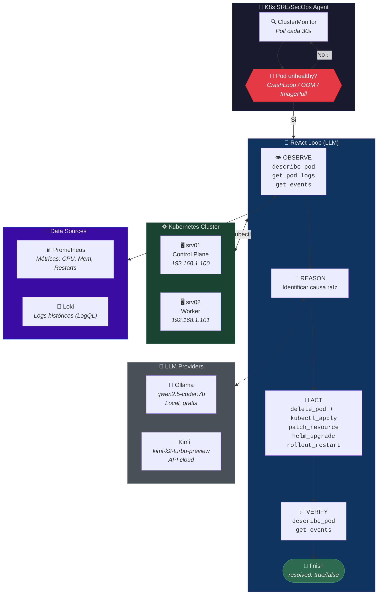

# 🚀 K8s SRE/SecOps Agent

🤖 Agente ReAct (Reason → Act → Observe) para diagnóstico y remediación autónoma
de incidentes en Kubernetes, potenciado por LLM (compatible con Ollama, Kimi, OpenAI, etc.)

## 🏗️ Arquitectura



## 📋 Requisitos

- 🐍 Python 3.10+
- ☸️ Kubernetes cluster (kubectl configurado)
- 🦙 Ollama (para correr el LLM localmente) o API key de Kimi/OpenAI
- 📜 (Opcional) Loki instalado en el cluster para logs históricos
- 📊 (Opcional) Prometheus instalado para métricas

## 🚀 Instalación

### 1️⃣ Clonar el repositorio

```bash
git clone https://github.com/safernandez666/k8s-sre-agent.git
cd k8s-sre-agent
```

### 2️⃣ Instalar dependencias

```bash
pip install -r requirements.txt
```

### 3️⃣ Instalar Ollama (opción local, recomendado)

**🐧 Linux/Mac:**
```bash
curl -fsSL https://ollama.com/install.sh | sh
```

**🪟 Windows:**
Descargar desde: https://ollama.com/download/windows

### 4️⃣ Descargar un modelo con Ollama

```bash
# 🌟 Modelo recomendado (rápido y bueno para coding)
ollama pull qwen2.5-coder:7b

# Alternativas:
# ollama pull llama3.2:3b        # Más liviano 🪶
# ollama pull codellama:7b       # Especializado en código 💻
# ollama pull mistral:7b         # Buen balance ⚖️
```

### 5️⃣ Verificar que Ollama esté corriendo

```bash
ollama list
# Debería mostrar el modelo descargado

# Probar el modelo
ollama run qwen2.5-coder:7b "Hola"
```

## ⚙️ Configuración

Editá `config.yaml` con tu configuración:

```yaml
llm:
  ollama:
    api_key: "ollama"                    # Ollama no valida API key
    model: "qwen2.5-coder:7b"
    base_url: "http://localhost:11434/v1"
  kimi:
    api_key: "sk-TU-API-KEY"             # API key de Kimi (moonshot.ai)
    model: "kimi-k2-turbo-preview"
    base_url: "https://api.moonshot.ai/v1"

kubernetes:
  namespace: "monitoring,default,kube-system,prd"
  kubeconfig: null         # null = usa ~/.kube/config

agent:
  poll_interval: 30        # segundos entre ciclos
  auto_remediate: false    # true = actúa sin confirmación
  max_iterations: 8        # máximo pasos ReAct
  dry_run: false

loki:
  url: "http://<LOKI_LB_IP>:3100"
  enabled: true            # true = usa logs históricos

prometheus:
  url: "http://<PROMETHEUS_LB_IP>:9090"
  enabled: true            # true = usa métricas
```

Al iniciar, el agente muestra un menú para elegir el proveedor LLM:

```
┌─────────────────────────────────┐
│   Seleccionar proveedor LLM     │
├─────────────────────────────────┤
│  1) ollama     (qwen2.5-coder:7b)
│  2) kimi       (moonshot-v1-8k)
└─────────────────────────────────┘
```

## 🎮 Uso

```bash
# 🔄 Monitor continuo (selector interactivo de LLM)
python main.py

# 🎯 Elegir LLM directo por CLI
python main.py --llm ollama
python main.py --llm kimi

# 🤖 Monitor continuo autónomo (sin confirmación)
python main.py --auto

# 🧪 Simular sin ejecutar nada
python main.py --dry-run --auto

# 🎯 Fix directo para un problema específico
python main.py --fix "Pod prometheus-grafana en CrashLoopBackOff"

# ▶️ Un solo ciclo de detección
python main.py --once
```

## 🛠️ Herramientas disponibles para el agente

| Herramienta | Tipo | Descripción |
|-------------|------|-------------|
| 👁️ `get_pod_logs` | **Observe** | Logs del contenedor (último crash) |
| 👁️ `describe_pod` | **Observe** | kubectl describe pod |
| 👁️ `get_events` | **Observe** | Eventos del namespace/recurso |
| 👁️ `check_rbac` | **Observe** | Permisos del ServiceAccount |
| 📜 `query_loki` | **Observe** | Logs históricos de Loki (LogQL) |
| 📜 `search_errors_in_loki` | **Observe** | Busca patrones de error en logs |
| 📊 `query_prometheus` | **Observe** | Ejecutar queries PromQL |
| 📊 `get_pod_metrics` | **Observe** | CPU, memoria, restarts de un pod |
| 📊 `get_high_resource_pods` | **Observe** | Detecta pods con >80% CPU/memoria |
| 📊 `analyze_pod_health` | **Observe** | Análisis completo de salud del pod |
| 🔧 `delete_pod` | **Act** | Elimina un pod (necesario antes de recrear bare pods) |
| 🔧 `patch_resource` | **Act** | Patch merge a Deployments/StatefulSets |
| 🔧 `helm_upgrade` | **Act** | Modifica valores del chart |
| 🔧 `kubectl_apply` | **Act** | Aplica manifest YAML (crear/recrear pods, RBAC, etc) |
| 🔧 `rollout_restart` | **Act** | Reinicio graceful de deployment |
| 🏁 `finish` | **Terminate** | Cierra el loop con resultado |

### 📝 Ejemplos de consultas Loki

El agente puede usar LogQL para obtener contexto histórico:

```logql
# Logs de los últimos 24 horas
{namespace="monitoring", pod=~"grafana.*"}

# Buscar errores en el último día
{namespace="default"} |= "error"

# Logs de múltiples pods simultáneamente
{namespace="kube-system", pod=~"calico.*"}
```

### 📊 Ejemplos de consultas Prometheus

El agente puede usar PromQL para obtener métricas:

```promql
# Uso de CPU por pod
rate(container_cpu_usage_seconds_total{namespace="monitoring"}[5m])

# Uso de memoria
container_memory_usage_bytes{namespace="monitoring"}

# Restarts de contenedores
kube_pod_container_status_restarts_total{namespace="monitoring"}

# Pods con alta utilización de CPU
rate(container_cpu_usage_seconds_total[5m]) > 0.8
```

## 📜 Integración con Loki + Grafana (Opcional pero recomendado)

Para que el agente tenga acceso a logs históricos:

### 1️⃣ Instalar Loki

```bash
helm repo add grafana https://grafana.github.io/helm-charts
helm upgrade --install loki grafana/loki-stack \
  --namespace monitoring \
  --set promtail.enabled=true
```

### 2️⃣ Exponer Grafana con Ingress

```bash
# Aplicar configuración de MetalLB + Ingress
kubectl apply -f https://raw.githubusercontent.com/kubernetes/ingress-nginx/controller-v1.9.6/deploy/static/provider/cloud/deploy.yaml

# Configurar Ingress para Grafana
kubectl apply -f loki-datasource.yaml  # Ver archivo en repo
```

### 3️⃣ Configurar /etc/hosts

```
192.168.1.240   grafana.local
```

Acceder a: http://grafana.local

## 📊 Integración con Prometheus (Opcional pero recomendado)

Para que el agente tenga acceso a métricas:

### 1️⃣ Instalar Prometheus

```bash
helm repo add prometheus-community https://prometheus-community.github.io/helm-charts
helm upgrade --install prometheus prometheus-community/kube-prometheus-stack \
  --namespace monitoring
```

### 2️⃣ Exponer Prometheus y Loki con LoadBalancer

Para que el agente (corriendo fuera del cluster) pueda alcanzar los servicios:

```yaml
# srv-monitoring.yaml
apiVersion: v1
kind: Service
metadata:
  name: loki-lb
  namespace: monitoring
spec:
  type: LoadBalancer
  selector:
    app: loki
  ports:
  - port: 3100
    targetPort: 3100
---
apiVersion: v1
kind: Service
metadata:
  name: prometheus-lb
  namespace: monitoring
spec:
  type: LoadBalancer
  selector:
    app: prometheus
  ports:
  - port: 9090
    targetPort: 9090
```

```bash
kubectl apply -f srv-monitoring.yaml
# Verificar las IPs asignadas por MetalLB
kubectl get svc -n monitoring loki-lb prometheus-lb
```

Luego actualizar `config.yaml` con las IPs asignadas.

### 3️⃣ Agregar Prometheus como Data Source en Grafana

| Campo | Valor |
|-------|-------|
| Name | `Prometheus` |
| URL | `http://prometheus-kube-prometheus-prometheus:9090` |
| Access | Server (default) |

## 🗺️ Roadmap

```
v0.1 (actual) ✅
├── 🤖 ReAct sobre kubectl
├── 🚨 Detección de CrashLoop / OOMKill / ImagePull
├── 🔧 Fix de RBAC, Helm, manifests
├── 📜 Integración Loki para logs históricos ✅
└── 📊 Integración Prometheus para métricas ✅

v0.2 (próximo)
├── 🔒 Integración Wazuh (alertas EDR)
├── 💾 Memoria de incidentes (SQLite)
├── 📢 Notificaciones (Slack/webhook)
└── 📈 Dashboard web de incidentes

v0.3
├── 👤 Gestión de identidades (IAM)
├── 🔗 Correlación usuario → alerta → pod
└── 🛡️ MITRE ATT&CK mapping
```

## 🐛 Troubleshooting

### 🦙 Ollama no responde

```bash
# Verificar que ollama esté corriendo
curl http://localhost:11434/api/tags

# Reiniciar ollama
ollama serve
```

### ☸️ El agente no encuentra el cluster

```bash
# Verificar kubectl
kubectl get nodes

# Especificar kubeconfig en config.yaml
kubernetes:
  kubeconfig: "/ruta/a/tu/config"
```

### 📜 Loki no conecta

```bash
# Verificar que Loki esté corriendo
kubectl get pods -n monitoring | grep loki

# Probar desde el pod de Grafana
kubectl exec -it -n monitoring deployment/prometheus-grafana -- \
  wget -qO- http://loki.monitoring.svc.cluster.local:3100/ready
```

### 📊 Prometheus no conecta

```bash
# Verificar que Prometheus esté corriendo
kubectl get pods -n monitoring | grep prometheus

# Verificar servicios LoadBalancer
kubectl get svc -n monitoring loki-lb prometheus-lb

# Probar conectividad desde fuera del cluster
curl http://<PROMETHEUS_LB_IP>:9090/api/v1/status/buildinfo
curl http://<LOKI_LB_IP>:3100/ready
```

## 📄 Licencia

📝 MIT
